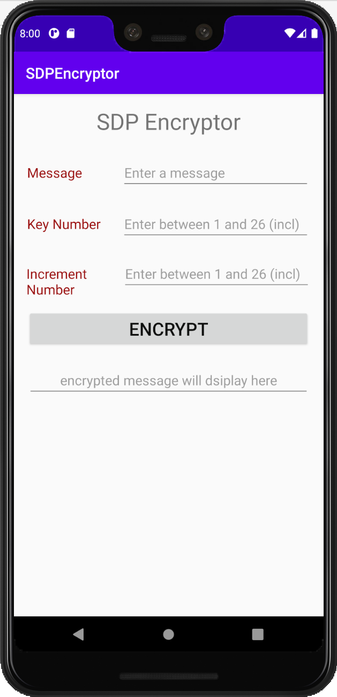
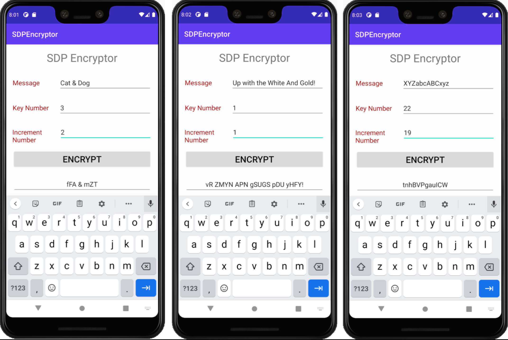
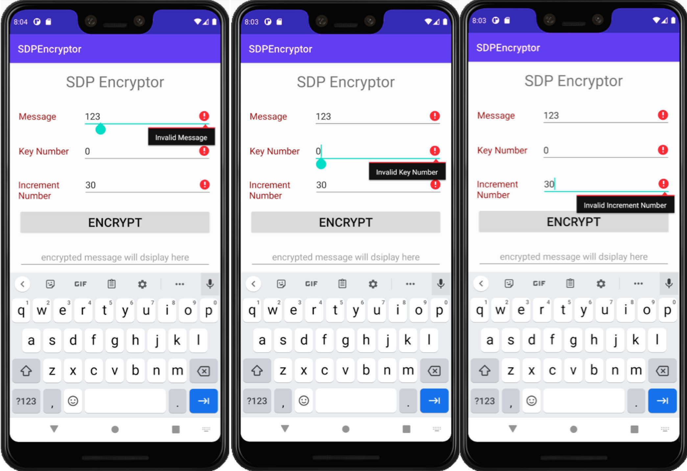

|Application |  SDPEncryptor |
|-----------|----------------------------------|
|Author | Kyaw Lwin |
|Utility | Android Studio, java |
|Date | 6/5/2020 |

## SDP Encryptor User Manual

### Functionality

A simple implementation of alphabetical substitution in a given message by a shift amount of the alphabets (`Key Number`) and a number of shifted alphabets sequentially in the message (`Increment Number`). 

### I/O

* User Input
	* Non-numerical message 
	* Key number 
	* Increment number
* Output
	* Encrypted message

<p align="center">
</p>
<p align="center">Figure 1. SDPEncryptor app on android phone</p>

### Example

A few examples were shown here. 

**`Algorithm`**

```
* Input:
  * Message = “Cat & Dog”
  * Key Number = 3
  * Increment Number = 2
* Output:
  * Encrypted Message“ = fFA & mZT” 
(C+3, a+5, t+7, ‘ ‘, &, ‘ ‘, D+9, o+11, g+13).
```

<p align="center">
</p>
<p align="center">Figure 2. SDPEncryptor app encrypting user defined messages</p>

### Error on Invalid inputs

1. Invalid Message 
A message is number or has no alphabets. 

2. Invalid Key Number
A key number must be between 1 and 26 including. 

3. Invalid Increment Number 
An increment number must be between 1 and 26 including. 

<p align="center">
</p>
<p align="center">Figure 3. Invalid inputs</p>

