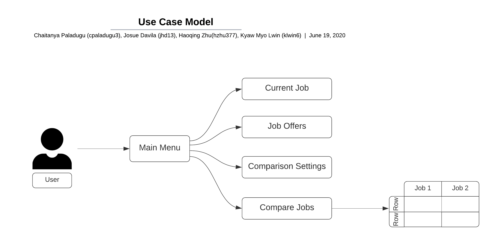

#Team77

## 1 Use Case Diagram

Figure. Use Case Model for Compare Job app

## 2 Use Case Descriptions

### Main Menu
- Requirement: There is no specific requirement for a user to use the app. 
- Pre-conditions: There is not pre-condition required for a user to use the app. 
- Post-conditions: User is able to see the main menu.
- Scenarios:
  - if a user uses the app for the first time, the app has no database. 
  - if a user already used the app, closed and reopened the app, the job offers database if created previously will be available to add more job offers or compare jobs. 
  - A list of main menu is presented. 
    - current job details
    - job offers
    - comparison settings
    - compare jobs
  - User can choose any options from the list and moves on to next screen. 
  
### Current Job Details
- Requirement: User has a current job information such as Title, Company, etc.
- Pre-conditions: User has a current job information such as Title, Company, etc or might not have one.
- Post-conditions: User can save the current job details or exit without saving the current job in the database. 
- Scenarios:
  - User fill up job details i.	Title, ii.	Company, iii.	Location (entered as city and state), iv.	Overall cost of living in the location (expressed as an index), v.	Yearly salary, vi.	Signing bonus, vii.	Yearly bonus, viii.	Retirement benefits (as percentage matched), ix.	Leave time (vacation days and holiday and/or sick leave, as a single overall number of days)
  - User can either save the current job details or exit without saving. 
  - If saved, the job details are saved in app database which will persist even after the app is closed.
  - User can exit to the main menu. 

### Job Offers
- Requirement: User has job offers as Title, Company, etc.
- Pre-conditions: User has job offers such as Title, Company, etc or might not have one.
- Post-conditions: User can save the job offers or exit without saving the job offers in the database. 
- Scenarios:
  - User fill up job details i.	Title, ii.	Company, iii.	Location (entered as city and state), iv.	Overall cost of living in the location (expressed as an index), v.	Yearly salary, vi.	Signing bonus, vii.	Yearly bonus, viii.	Retirement benefits (as percentage matched), ix.	Leave time (vacation days and holiday and/or sick leave, as a single overall number of days)
  - User can either save the job offer details or exit without saving. 
  - If saved, the job details are saved in an existing database which will persist even after the app is closed.
  - User can also delete the job offers in pre-existing job offers list. 
  - User can exit to the main menu.  

### Job Comparison Settings 
- Requirements: User enters the weight for each five parameters to rank all the jobs in the database. 
- Pre-conditions: User has a job database that can be calculated using the settings. 
- Post-conditions: Jobs are ranked from best to worst based on the settings that User entered. 
- Scenarios:
  - User enters the settings.
  - If saved, the weights are calculated for AYS (yearly salary adjusted for cost of living), ASB (signing bonus adjusted for cost of living), AYB (yearly bonus adjusted for cost of living), RBP (retirement benefits percentage) and LT (leave time). 
  - User exits the setting screen. 

### Compare Jobs 
- Requirements: User entered the `Job Comparison Settings` already. If not, default value of `1` for five parameters are used to rank all the jobs available in the database. 
- Pre-conditions: User has entered the `Job Comparison Settings` already. 
- Post-conditions: User can see the list of all jobs in the database from best to worst based on either the weights he adjusted in the settings or default value. 
- Scenarios: 
  - User can choose two jobs out of all the listed jobs. 
  - User will be directed to `Job Comparison` screen. 
  
  
### Job Comparison
- Requirements: User has chosen two jobs from the rankings available in `Compare Job` screen.
- Pre-conditions: User has set the comparison settings and selected two jobs from the rankings.  
- Post-conditions: User can see the comparison between two jobs selected. 
- Scenarios: 
  - Use can see the comparison between two jobs selected with the following details:
    -  i.	Title
    - ii.	Company
    - iii.	Location
    - iv.	Yearly salary adjusted for cost of living
    - v.	Signing bonus adjusted for cost of living
    - vi.	Yearly bonus adjusted for cost of living
    - vii.	Retirement benefits (as percentage matched)
    - viii.	Leave time
  - User can either choose to do next job comparisons from the previous screen or exit to the main menu. 
